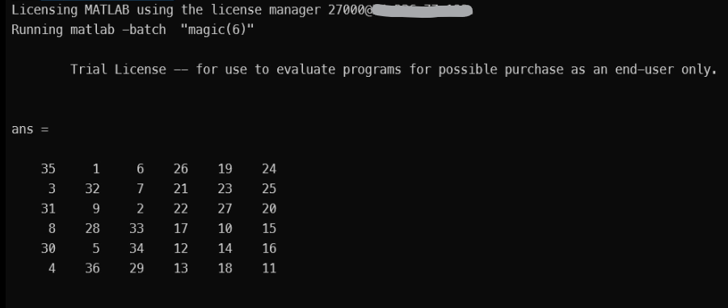
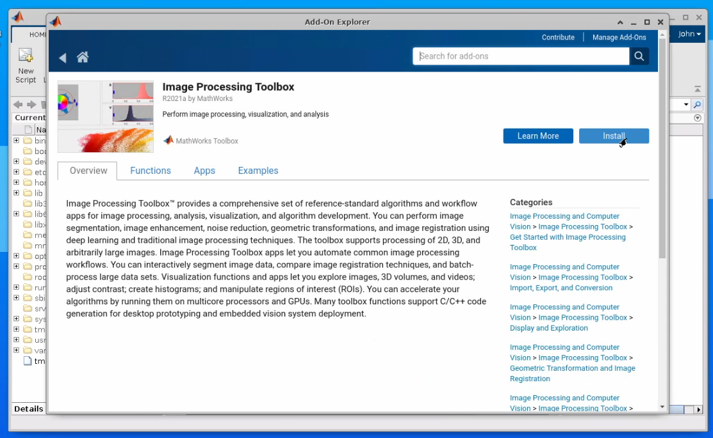

# Getting Started with MATLAB&reg; in Docker

Running MATLAB inside a docker container can be challenging if you're building it on your own. Fortunatly, we've done most of the work for you.  This set of tutorials will walk you through the steps to downloading, running and even building your own MATLAB containers. 

## Docker Components

There are two primary components to docker, the Docker Engine and Docker Client.   The Engine is a background process that manages the containers. The client is the command line tool used to build and run containers.  Once installed you don't generally need to worry about the engine.  You'll interact with docker using the client.

## Install Docker

To follow these tutorials you'll need docker installed on your machine.  Head over to docker.com to [download and install](https://www.docker.com/products/docker-desktop) docker for your platform (Windows, Mac or Linux).  Once you're set up join me below to learn how to run MATLAB in containers.

## Lessons
[Running a MATLAB Container](#runmatlab)

[Accessing the MATLAB Desktop](#desktop)

[Running in Batch Mode](#runbatch)

[Accessing files](#files)

[Image snapshots](#snapshots)

[Customizing a MATLAB Container Image](#buildmatlab)

[Building from scratch](#buildscratch)

## Resources
- MATLAB-Deps container image 
https://hub.docker.com/r/mathworks/matlab-deps
- MathWorks Dockerfile for DIY on GitHub
https://github.com/mathworks-ref-arch/matlab-dockerfile
- MATLAB Deep Learning Image on Nvidia GPU Cloud
https://ngc.nvidia.com/catalog/containers/partners:matlab
https://insidelabs-git.mathworks.com/jlmartin/docker/tree/master/nvidia-gpu-cloud/matlab-r2019b

Note that you can put anything in a container.  It's not a matter of whether you can but whether you should. Match the solution to the use case.
e.g. you can create a container with MATLAB Runtime and a compiled application and deploy it to multiple servers but Production Server would be a better match for this use case.

# Working with containers

<a name="run"></a>
## Running MATLAB in a container

In this tutorial, you'll learn how to use the docker client to pull and run containers from existing images, view the images and containers on your machine, and delete images and containers.

We'll get started by using the basic MATLAB docker image published by MathWorks.  This container includes everything you need to run MATLAB and is a good starting point.

To run a container we'll first need to locate one.  The primary place to find container images is [DockerHub](https://dockerhub.com), a centralized docker container image registry. There you'll find thousands of containers for all sorts of uses.  A registry is where images are stored and distributed.  Images are stored in individual repositories which hold all the versions of an image.  Since we're interested in MATLAB we can find it at https://hub.docker.com/r/mathworks/matlab.

### Pull a container
To download the image we tell docker which one to.  By default this will try to find the image on DockerHub.  

To pull the latest matlab image we use the pull command.

```bash
docker pull mathworks/matlab
```
Docker will contact the registry and download the requested container image.  We've just pulled the latest image but it is possible to pull a specific version by using a tag.  For instance, we could have run ```docker pull matlab:r2021a```

This will take some time depending on your bandwidth since the image is pretty big.  Once the download completes we can view the image.

```bash
docker images
```
This will list the images on this machine


Now that we have the image we'll start a container from it using the run command*.  

### Run a container
```bash
docker -it mathworks/matlab
```

This will launch MATLAB.  The ```-it``` switch indicates we want an interactive terminal.  

#### Licensing check
By default this container is configured to use Online Licensing so if you have an individual license or your organization is setup to use Online  Licensing enter your MathWorks Account username and password. 


Running the ver command lists MATLAB as the one product installed in the container. 

Type ```exit``` and press RETURN.  This will exit the container. 

Docker's process status command (ps) will show us the containers on our system.

```bash
docker ps -a
```
Passing the -a flag tells docker to show all containers on this machine regardless of status.  Here we can see the one container we ran with the status of Exited.


The container still exists.  We could relaunch it or snapshot it at this point.  However, it's just taking up disk space so lets delete it.

```bash
docker rm 224650169f24
```

The container may be gone but the image persists.  Run ```docker images``` again and you should see the image is still where we left it.  


That's a great start but what MATLAB is much more interesting if you can access the Desktop.  Let's see how we can do that.

<a name="desktop"></a>
## Running MATLAB Desktop in a container

The image provides a convient option to run in VNC mode.  This will let you connect either a browser or a VNC client to access the desktop.  We can access those with docker run command.

### Launching with VNC mode
```bash
docker run -it --rm -p 5901:5901 -p 6080:6080 mathworks/matlab -vnc
```

There's a whole lot going on in the line so let's break it down.

 `--rm` tells docker to remove the container when it stops.  
 `-p` opens a port.  Containers run in an isolated environment so we need to tell docker which ports to allow into the container.  The first number is the port on the host machine (your machine if running locally) and the second is the port inside the container.  when we navigate to a port on the localhost it is redirected to the container's port.  The first port 5901 is the standard VNC port which you can see in action below.  The second port is for web access to the VNC session.  We'll see that in just a moment.
 `-vnc` This isn't a docker option.  It's an option sent to the matlab image when it starts up.  There are several switches.  Run ```docker run mathworks/matlab -help``` to see all the options

> insert output image

### Connecting to the desktop in a browser
Open a web browser and navigate to ```localhost:6080```.  You should see a desktop in your browser.  Double-click the MATLAB icon on that desktop and you'll be prompted like before.  Enter your MathWorks Account credentials, select a license if necessary and now you can use the MATLAB desktop.  


### Using a VNC client
That other port mapping we provided is the standard VNC port.  If you have a VNC client on your machine you can open that and enter ```localhost:1``` when prompted and enter the password.  By default that is *matlab*.  You can change the password used when you launch the container if you prefer.

Once you connect you'll see the same window as you saw in the browser.  If you have them both open at the same time you'll notice they are views into the same desktop session.  

You may see a warning when running the container to provide it more memory.  
```bash
docker run -it --rm -p 5901:5901 -p 6080:6080 --shm-size=512M  mathworks/matlab -vnc
```

If you're running on Linux there is a more direct way to access the desktop using X11.  See https://hub.docker.com/r/mathworks/matlab for details.


<a name="batch"></a>
## Running MATLAB in Batch Mode

```bash
docker run -it --rm mathworks/matlab -batch "magic(6)"
```


```bash
docker run -it --rm -MLM_LICENSE_FILE=27000@12.123.12.123 mathworks/matlab -batch "magic(6)"
```
Insert the IP address in place of my clearly made up IP address.




```bash
docker ps -a
```


<a name="files"></a>
## Accessing files

Create a sample file in the current directory called "myscript.m".  We'll use this file as a batch command run by matlab.  

```dos
"magic(6)" > myscript.m
```

```bash
docker run -it --rm -MLM_LICENSE_FILE=27000@12.123.12.123 -v "${PWD}:/mnt/scripts" mathworks/matlab -batch "ls /mnt/scripts"
```

>results showing listing

```bash
docker run -it --rm -MLM_LICENSE_FILE=27000@12.123.12.123 -v "${PWD}:/mnt/scripts" mathworks/matlab -batch "run('/mnt/scripts/myscript.m')"
```

> insert run results


<a name="snapshots"></a>
## Customizing: Making snapshots

MATLAB is great and all but it's even better with some toolboxes.  In this tutorial we'll add the Image Processing Toolbox to our container and snapshot an image from that.  We will then launch a new container based on our new customized image.

1. Launch a MATLAB Container in vnc mode

```bash
docker run -it --rm -p 6080:6080 mathworks/matlab -vnc
```

2. Run MATLAB as sudo

```bash
sudo matlab
```

 

3. Add Image Processing Toolbox (or another if you like)




4. Snapshot the image

Open a new command window
```docker
docker ps -a
```


Snapshot the image by commiting the current container

```docker
docker commit intesting_liskov mymatlab:imageprocessing
```


Launch a new container based on our new image

```docker
docker run -it --rm -p 6080:6080 mymatlab:imageprocessing -vnc
```

Run ver again and you'll see that image processing is already installed in this image. 

<a name="build"></a>
## Customizing: Build your own image

Let's learn how we can build our own image using a Dockerfile.  In this tutorial, we'll write our own Dockerfile to include a script file in the image which will run matlab batch for us.

Create a new document called "Dockerfile".  Ensure you don't end up with an extension.

```Dockerfile
# Build from MATLAB base image
FROM mathworks/matlab:latest

# Copy your script into the image
COPY myscript.m ./

# Start MATLAB in batch mode to execute script
CMD ["matlab", "-batch", "myscript"]
```

```docker
docker build -t matlab:withscript .
```

```docker
docker run -it --rm matlab:withscript
```

```docker
docker rmi matlab:withscript
```

<a name="build"></a>
## Customizing: Build from scratch

You can have full control over the selection of products or the operating system then you'll want to build your own using a Dockerfile.  A great place to start is this Dockerfile that includes a lot of the configuration you may need for your own container.  It is based on the mathworks/matlab-deps container image, an image that includes all the common dependencies required by MATLAB and related products.  If you would like a different OS than Ubuntu then you'll need to build those dependencies from scratch.  